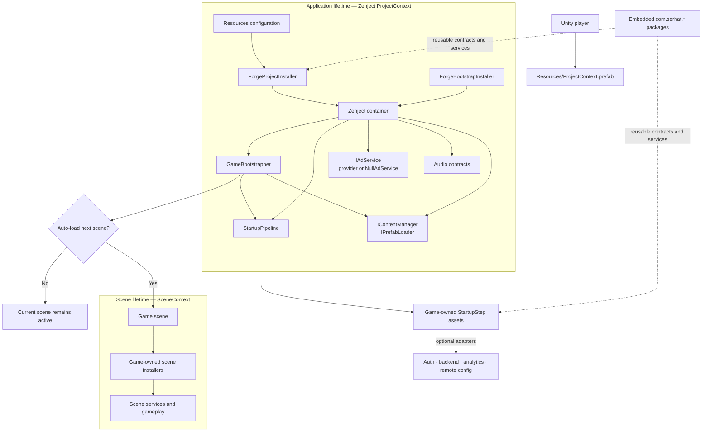
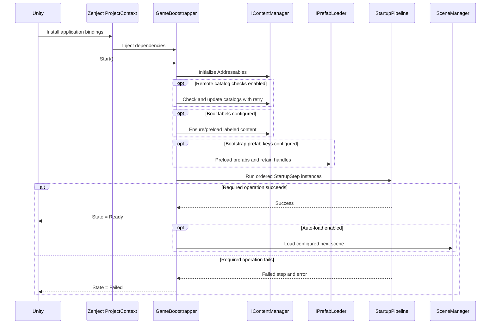

# Architecture

Serhat Forge uses one application composition root, explicit lifetime ownership, an observable asynchronous boot sequence, and vendor-neutral service boundaries. Game-domain code is expected to extend those boundaries rather than accumulate inside the bootstrapper.

[← README](../README.md) · [Getting started](GETTING_STARTED.md) · [Features](FEATURES.md) · [Core systems](CORE_SYSTEMS.md)

## Design goals

- Keep the startup path deterministic and failure-aware.
- Make application, scene, and object lifetimes explicit.
- Keep Addressables handles and other disposable resources owned by a service.
- Keep game rules separate from infrastructure and vendor adapters.
- Allow offline or unavailable providers to degrade through an explicit policy.
- Keep optional SDKs out of the compile graph until intentionally enabled.
- Preserve mobile IL2CPP/managed-stripping behavior through tests and explicit preservation.

The template is intentionally pragmatic: use the abstractions where they protect a boundary or lifecycle, and do not create an interface for every class merely to match a pattern.

## Runtime overview



The arrows show ownership and dependency flow, not a requirement that every package be bound by the default installer. Most embedded packages are foundations the game opts into and composes deliberately.

## Composition roots and lifetimes

### Application lifetime

Zenject loads `Assets/Resources/ProjectContext.prefab` before the scene context. It contains:

- `ProjectContext`, the application container;
- `ForgeProjectInstaller`, which binds generic configuration and application services;
- `ForgeBootstrapInstaller`, which binds the bootstrapper instance; and
- `GameBootstrapper`, the persistent boot orchestrator.

The default `ForgeProjectInstaller` binds:

- `ContentConfiguration` loaded from Resources, with runtime fallback defaults;
- content retry policy and `StartupPipeline`;
- `AddressablesContentManager` as `IContentManager`;
- `PrefabLoaderService` as `IPrefabLoader`;
- the configured ad provider or `NullAdService`;
- `SoundManager` contracts or `NullAudioService`; and
- `NullLoadingScreen` as a safe fallback.

Add application-wide services in focused `MonoInstaller` or `ScriptableObjectInstaller` types and assign them to `ProjectContext`. The repair tool preserves additional assigned installers. Avoid turning `ForgeProjectInstaller` into one unreviewable registration list.

### Scene lifetime

Every scene that resolves scene-specific dependencies should have one `SceneContext`. Bind presenters, scene controllers, level state, and other scene-owned services there. They may depend on application contracts through the parent `ProjectContext`; application services must not hold accidental references to destroyed scene objects.

`SampleScene` contains a `SceneContext` and `ForgeDemoPanel`. The panel is a removable smoke test, not a required runtime UI.

### Runtime-created objects

An injected object must be created through a Zenject factory/container API or be explicitly injected after creation. A plain `new` or `Object.Instantiate` does not invoke Zenject injection by itself.

For Addressables prefabs with injection requirements, choose and document one ownership path:

1. load the prefab through the content service;
2. instantiate through a Zenject-aware factory/container operation, or explicitly call container injection; and
3. make the instance, pool, and Addressables handle lifetimes unambiguous.

## Boot sequence

`GameBootstrapper` starts automatically by default and exposes state/progress/completion events. A normal boot follows this order:



The clean clone has no catalog checks, preload labels, bootstrap prefab keys, or auto-loaded next scene. It still initializes Addressables and reaches `Ready`, proving composition without making a network request.

### Startup step contract

Each `StartupStep` owns one operation such as save restore, authentication, remote configuration, analytics startup, or force-update evaluation. It declares:

- required or optional behavior;
- timeout duration;
- cancellation grace duration;
- retry count; and
- retry delay.

The pipeline serializes steps in Inspector order. A required step failure stops boot. An optional failure is logged and boot continues. A disabled optional component is skipped; a disabled required component is a configuration failure.

Timeout cancels the operation cooperatively. Implementations must observe the token and stop within their cancellation grace period. Do not start an untracked second task or blindly retry a non-idempotent write.

## Content ownership

`AddressablesContentManager` is the application content boundary. `ContentHandle<T>` wraps a Unity Addressables handle and releases it idempotently. `PrefabLoaderService` retains handles for application-lifetime prefabs and releases them together.

Ownership rules:

- The caller that receives a content handle owns it unless ownership is transferred explicitly.
- Release through `IContentManager`/`IContentHandle`; do not separately release the same Unity handle.
- A pool owns its live instances and reset policy; it does not implicitly solve the lifetime of the source Addressables handle.
- Remote catalogs stay disabled until the game defines environment URLs, cache/offline behavior, compatibility, versioning, and rollback.

The default labels—`core`, `gameplay`, `ui`, and `audio`—are conventions, not hard-coded game taxonomy.

## Persistence boundary

Persistence is supplied as reusable primitives rather than a global singleton bound by default:

```text
game state participants
        │ capture / restore / rollback
        ▼
SaveCoordinator<TData>
        │ serialized single-writer operations
        ▼
VersionedJsonSaveRepository<TData>
        │ version / migrations / checksum / generation recovery
        ▼
project-selected local storage path
```

Game code defines `TData`, version migrations, capture/restore participants, and the lifecycle policy. Transactional restore is fail-closed by default: participants provide pre-mutation snapshots, and a later failure rolls back earlier mutations in reverse order.

Keep authoritative or security-sensitive economy state on a backend when the threat model requires it. Local integrity checks detect accidental corruption; they do not establish trust.

## Package and integration boundaries

Reusable packages are embedded under `Packages` so a clean clone resolves without a separate private registry:

| Package | Responsibility |
|---|---|
| `com.serhat.core-sdk` | Shared runtime primitives used by other Serhat packages |
| `com.serhat.analytics-sdk` | Analytics model, queue/outbox, provider contracts, service builder, optional Firebase provider |
| `com.serhat.backend-sdk` | Transport-independent resilience, outbox, coalescing, telemetry, optional PlayFab adapter |
| `com.serhat.localization-sdk` | Locale model, providers, fallback, pluralization, formatting, TMP integration, editor import tools |
| `com.serhat.monetization-sdk` | Store/purchase abstractions, pending purchase recovery, backend verification and entitlement contracts |

The full template is the supported zero-configuration package graph: all `com.serhat.*`
packages are embedded together. A Git subpath install of `com.serhat.localization-sdk` must also
add `com.serhat.core-sdk`; a Git subpath install of `com.serhat.monetization-sdk` must also add
`com.serhat.backend-sdk`. Pin every sibling URL to the same immutable tag or commit. The preview
SemVer entries in package manifests are for the embedded/registry dependency graph and do not
make Unity Package Manager discover sibling packages in a Git repository automatically.

Provider assemblies use define constraints or conditional compilation. The intended sequence is always:

1. install a compatible SDK;
2. add environment-specific, secret-safe configuration;
3. enable the documented scripting symbol;
4. compose the adapter behind its interface; and
5. run editor, device, backend, and failure-path validation.

See [Integrations](INTEGRATIONS.md) for the exact symbols and gates.

## Reference backends are outside the runtime contract

`Samples~/GameApiBackend` demonstrates one game-shaped Azure Functions/PlayFab-style API. Its progression and economy contracts are examples, not reusable Serhat Forge domain types.

`cloudscript-azure-functions-monetization` demonstrates a server-side monetization boundary. It still requires the game's store identifiers, trust roots, credentials, deployment environment, monitoring, and security validation.

Both directories can be removed when the game uses a different backend. Their existence must not cause client gameplay to depend on sample contracts by default.

## IL2CPP and reflection

Private Zenject injection points used by first-party runtime code are preserved in `Assets/link.xml`. Providers instantiated through runtime type lookup carry explicit preservation. When adding private injection targets or reflection-created types:

- prefer direct registrations where practical;
- add explicit `Preserve`/linker declarations when necessary;
- keep the declaration as narrow as possible; and
- validate Android and iOS IL2CPP builds, not only Editor/Mono.

Do not “fix” a stripping issue by preserving entire assemblies without measuring its size and behavior impact.

## Repository map

```text
Serhat Forge/
├─ Assets/
│  ├─ AddressableAssetsData/        Addressables profiles, groups, schemas, builders
│  ├─ Editor/                       Project setup, batch builds, platform/editor tools
│  ├─ Plugins/
│  │  ├─ Zenject/                   Vendored DI runtime/editor source and patch notes
│  │  └─ iOS/                       Native Keychain and Game Center bridges
│  ├─ Resources/                    ProjectContext and safe runtime configuration assets
│  ├─ Scenes/SampleScene.unity      Removable composition smoke scene
│  ├─ Scripts/                      Application-level generic runtime foundations
│  ├─ StreamingAssets/Localization Starter locale data
│  └─ Tests/                        Template EditMode and PlayMode composition tests
├─ Packages/
│  ├─ com.serhat.*                  Embedded reusable packages
│  ├─ manifest.json                 Unity package graph
│  └─ packages-lock.json            Resolved package lock
├─ Samples~/GameApiBackend/         Optional game API backend reference
├─ cloudscript-azure-functions-monetization/
│                                    Optional monetization backend reference
├─ ProjectSettings/                 Pinned Unity project baseline
├─ Tools/                            Repository validation scripts
├─ docs/                             User and architecture documentation
└─ .github/workflows/                Repository, cloud, and opt-in Unity CI
```

Generated `Library`, `Temp`, `Logs`, `UserSettings`, `obj`, `.sln`, and Unity-generated `.csproj` files are local artifacts, not architecture. Do not commit or copy them to a new project.

## Where new code should go

| New responsibility | Preferred location/owner |
|---|---|
| Reusable, project-agnostic primitive shared by Serhat packages | The narrowest appropriate `Packages/com.serhat.*` package |
| Generic template-level runtime feature | A focused namespace under `Assets/Scripts` |
| Game-domain model, use case, or progression rule | A game-owned assembly/folder, not a generic Serhat package |
| Application-lifetime binding | A focused installer assigned to `ProjectContext` |
| Scene-lifetime binding/presenter/controller | A scene installer under `SceneContext` |
| Ordered boot operation | A small `StartupStep` with cancellation and failure policy |
| Vendor implementation | A provider assembly behind a project-owned/generic contract and compile gate |
| Editor automation | An Editor-only assembly/folder with no player dependency |
| Reference/demo code | `Samples~` or a clearly removable sample assembly |

## Architectural guardrails

- Keep one canonical application boot owner. Do not run a second independent content/bootstrap path in the same boot scene.
- Keep `GameBootstrapper` as orchestration; do not place game rules, SDK calls, or persistent mutable state inside it.
- Avoid service locator access from domain code. Inject the smallest useful contract.
- Do not allow an optional provider failure to masquerade as a required boot failure unless product policy requires it.
- Do not mark a required dependency optional merely to reach the menu.
- Do not bind scene objects as application singletons.
- Do not leak Addressables handles, duplicate-release them, or hide ownership in static helpers.
- Do not make client callbacks authoritative for currency, entitlements, or competitive state.
- Keep credentials and environment values outside source-controlled assets.
- Add tests at every new boundary: composition, cancellation, migration, offline behavior, provider mapping, and IL2CPP when relevant.
